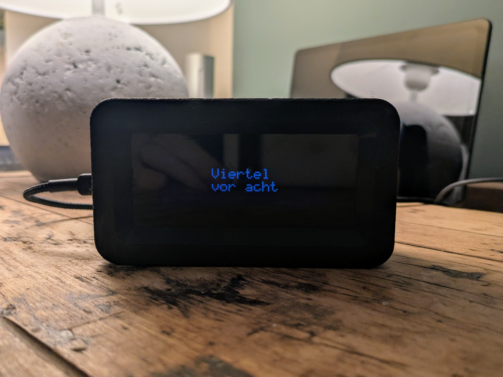
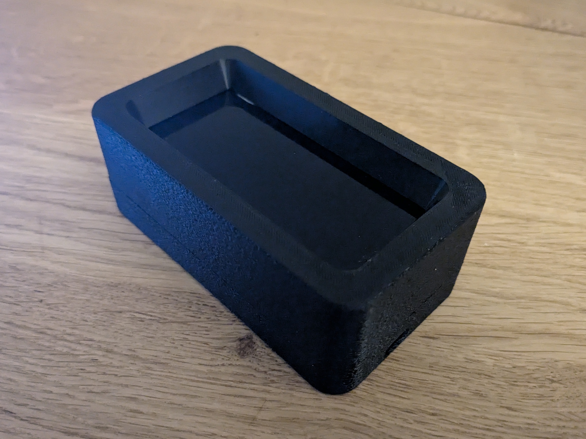

# LCD Text Clock

A text-based clock using an LCD display with I2C interface on an ESP microcontroller with automatic NTP time sync.
- Displays the current time and date as text like "five minutes to four"
- 16x2, 40*2 or 20x4 character LCD display support
- Customizable animations
- Supports buttons to flip between modes showing different informationwhich can be easily extended 
- Automatic backlight switching and dimming (optional feature) 
- Automatic time synchronization using NTP

The whole project rather serves as an example how text on a LCD display can be beautifully presented to users and can easily be extended/adapter to match your usecase.

1. Without pushbuttons


1. With 4 pushbuttons


# Index
- [Mechanics](#Mechanics)
- [Electronics](#Electronics)
- [Software](#Software)
- [Usage](#Usage)
- [Customization ideas](#customization_ideas)
- [Acknowledgements](#Acknowledgements)


## Mechanics

Two different types of housings for 20*4 LCD displays are provided.
Using the acrylic plate on top of the LCD is optional but gives a cleaner look (not used in the example photos)

Very simple housing that consist of a front and a back piece (Shown is the version with the pushbuttons)

| Front                                                | Back                                                 | Isometric |
| ---------------------------------------------------- | ---------------------------------------------------- | --------- |
|  |    |  |
|     |       |  |


### 3D-Printed Parts

1. Without pushbuttons:

| Filename                           | Thumbnail                                                                            | Required | Notes |
| ---------------------------------- | -------------------------------------------------------------------------------------| -------- | ------|
| `./print/Lower_part_nobuttons.stl` |  | 1        |       |
| `./print/Upper_part_nobuttons.stl` |  | 1        |       |


2. With 4 pushbuttons:


| Filename                       | Thumbnail                                                                              | Required | Notes |
| ------------------------------ | ---------------------------------------------------------------------------------------| -------- | ------|
| `./print/Lower_part.stl`       |              | 1        |       |
| `./print/Upper_part.stl`       |              | 1        |       |
| `./print/Pushbutton_base.stl`  |    | 1        |       |
| `./print/Pushbutton_cover.stl` |  | 1        |       |


Printer settings:
- All printed parts designed for PETG. 
- Best experience on my printer was to print the front upside down (the actual front of the case facing the print bed) as this does not require any supports. For a cleaner look you can consider to print it reversed with ironing enabled but note that this requires a lot of support material. 
- Using fuzzy skin for all outside walls creates a nice look
- Use ironing to get a nice clean look on top of the pushbutton baseplate and cover
- No rafts/brim etc. reguired for any model.

### Required parts

| Name              | Spec                          | Required | Notes |
| ----------------- | ----------------------------- | -------- | ------|
| countersunk screw | M3 5mm, e.g. DIN EN ISO 4762  | 4        | To attach ESP to back of housing |
| countersunk screw | M3 5mm, e.g. DIN EN ISO 4762  | 4        | To attach display to back of housing |
| cylinder head screw | M3 10mm | 4        | To fix back and front of housing |
| semi-transparent acrylic board | max 2mm, 95-100mm * 40-50mm | 1        | Optional, for cleaner look |


### Assembly

- The ESP is screwed to the back of the housing.
- The acrylic plate is glued to the front (optional)
- The LCD is then fixed via screws to the front
- When using the pushbuttons, click the pushbutton PCB into the baseplate and snap-in the pushbutton top cover. Then slide it into the lower part of the housing  
- Finally the lower and the upper part of the housing are assembled and tightened via the screws.
- Consider using some hot glue to make sure everything stays in place


## Electronics

### Part list

| Unit price | Quantity | Partname                   | Example   | Notes |
| ---------- | -------- | -------------------------- | --------- | ----- |
| 5 USD      | 1        | ESP32 Dev module           | <a href="https://de.aliexpress.com/item/1005006474308440.html">AliExpress</a> | USB-C Version |
| 5 USD      | 1        | 2004 HD44780 character LCD module | <a href="https://de.aliexpress.com/item/1005006656450425.html">AliExpress</a> | Consider "negative" LCD (colored fonts on black background), as this gives a clean look, esp. when placing under an acrylic plate |
| 1-2 USD    | 1        | PCF8574 I2C module for LCD | <a href="https://de.aliexpress.com/item/1005006686091415.html">AliExpress</a> | You might want to pick one that has a jumper to enable/disable backlight as we can "misuse" this to dim the backlight via GPIO |
| 1-2 USD    | Optional | 4 button module            | <a href="https://de.aliexpress.com/item/1005007272677522.html">AliExpress</a> | Optional | Unsolder SMD LED |

Total cost about 10-15 USD!


### Schematics


## Software

### Prerequisites

- PlatformIO
- LiquidCrystal_I2C (via PIO)
- ESPDateTime (via PIO)
- WiFiManager (via PIO)


### Installation

1. Clone the repository:
   ```sh
   git clone https://github.com/smengerl/LCD_Text_Clock.git
2. Open the project in PlatformIO.
3. Wait for PIO to configure and download the required libraries
4. Compile and upload the project to your ESP32 microcontroller.


## Usage
- Power on the ESP32.
- On first usage only: Configure the ESP to your local WiFi. For this, connect to the ESP's access point and use the default configuration page to enter your WLAN SSID and password 
- Wait for NTP sync
- The current time will be displayed on the LCD display.
- Use the (optional) buttons to flip through the pages and watch the animation


## Customization ideas

- Modify the text and backlight settings in the code to customize the display.
- Adjust the NTP server and time zone settings as needed.
- Add more pages, e.g. showing sensor data
- Get weather forecast via internet and display it on the screen with custom characters
- Write your own animations for text transitions


## Acknowledgements
- ESPDateTime library by mcxiaoke
- WiFiManager by wnatth3
- LiquidCrystal_I2C by marcoschwartz